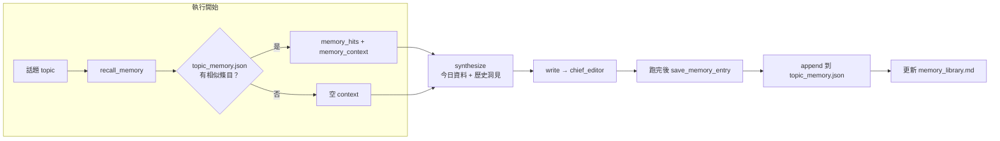

# Stage 3 記憶與 JSON 運作說明

本文件說明 `practice/stage3/graph.py` 裡**跨日話題記憶**如何持久化、檢索，以及相關 JSON 檔案的用途與格式。

程式入口：`practice/stage3/graph.py`  
流程概覽：`practice/stage3/note.md`

---

## 一句話總結

Stage 3 把每次跑完的**洞見**存進本機 JSON；下次跑**相似話題**時，在 `synthesize` 之前先**檢索**歷史洞見，當成 RAG 上下文注入 LLM，讓分析能「對照昨天說了什麼」。

這不是向量資料庫，而是**單一 JSON 檔 + 自製 embedding** 的簡化版 RAG，適合練習與本機實驗。

---

## 檔案一覽

| 路徑 | 是否入 git | 角色 |
|------|------------|------|
| `memory/topic_memory.json` | 否（`.gitignore`） | **主記憶庫**：所有歷史條目的原始資料 |
| `memory/memory_library.md` | 否 | JSON 的**人類可讀版**（不含 embedding 向量） |
| `outputs/run_{topic}_summary.json` | 否 | **單次執行報告**（含 memory_hits、token、revision） |
| `outputs/memory_library.md` | 否 | 該次執行結束時的記憶庫**快照** |

查看記憶庫（不跑 pipeline、不吃 API）：

```bash
cd practice
python stage3/graph.py --show-memory
```

---

## 資料流（何時讀、何時寫）



**讀取時機**：`authority` 之後、`synthesize` 之前的 `recall_memory` 節點。  
**寫入時機**：整條 pipeline 跑完後（`run_pipeline` 結尾），且本次有產出 `insights` 才寫入。

也就是說：記憶庫存的是**洞見（insights）**，不是完整草稿；草稿只留前 500 字當 `draft_excerpt` 方便人類回顧。

---

## `topic_memory.json` 結構

檔案是一個 **JSON 陣列**，每個元素是一筆「某天處理某話題」的記錄：

```json
[
  {
    "run_date": "2026-07-08",
    "topic": "AI agents",
    "insights": "# AI agents 趨勢歸納\n\n## 1. ...",
    "draft_excerpt": "# 草稿標題\n\n正文前 500 字...",
    "topic_embedding": [0.0625, 0.0, ...],
    "embedding": [0.0312, 0.125, ...]
  }
]
```

### 欄位說明

| 欄位 | 型別 | 用途 |
|------|------|------|
| `run_date` | string (`YYYY-MM-DD`) | 這筆記憶是哪一天寫入的 |
| `topic` | string | 當次輸入的話題 |
| `insights` | string | **RAG 檢索後注入 LLM 的主要內容**（synthesize 的歷史參考） |
| `draft_excerpt` | string | 最終草稿前 500 字，僅供人類回顧，**不參與檢索** |
| `topic_embedding` | `float[256]` | 只對 `topic` 做 embedding，**用來找相似話題** |
| `embedding` | `float[256]` | 對 `topic + insights` 做 embedding，預留欄位，目前檢索未使用 |

### 為什麼有兩種 embedding？

- **檢索**用 `topic_embedding`：比對「今天輸入的話題」和「過去哪幾天的話題像不像」。
- 若用整段 `insights` 做向量，長文會稀釋話題相似度，例如「AI agents」和「AI coding tools」可能被拉得很近或很遠，不穩定。
- `embedding`（topic + insights）先存著，之後若要改成「按洞見語意搜尋」可以再用。

---

## 檢索邏輯（`recall_similar_memories`）

1. 讀取 `topic_memory.json`（不存在則當空陣列）。
2. 對**本次話題**算 `query_vec = embed_text(topic)`。
3. 對每筆歷史記憶，用 `topic_embedding`（沒有則 fallback 重算 `embed_text(mem["topic"])`）。
4. 算 **cosine 相似度**；`>= MEMORY_SIMILARITY_THRESHOLD`（預設 **0.35**）才算命中。
5. 依相似度排序，取前 **3** 筆（`top_k=3`）。
6. 組成 `memory_context` 字串，寫入 state，供 `synthesize` 使用。

命中後，`synthesize` 的 prompt 會多一段：

```
【跨日記憶 RAG】
以下是系統過去處理過的類似話題與洞見，請在歸納時主動對照、延續或修正：

### 2026-07-06｜AI agents（相似度 1.00）
（該日的 insights 全文）
```

`memory_hits` 會留在 state 裡，最後也會寫進 `run_*_summary.json`。

---

## Embedding 向量怎麼算出來

記憶庫裡的 `topic_embedding` / `embedding` **不是**呼叫 OpenAI、Claude 等 embedding API，而是 `graph.py` 內的 **feature hashing**（純 Python、免費、本機即時算完）。

對應程式：

```python
def embed_text(text: str, dim: int = EMBED_DIM) -> list[float]:
    vec = [0.0] * dim
    for token in _tokenize(text):
        digest = hashlib.md5(token.encode("utf-8")).hexdigest()
        idx = int(digest, 16) % dim
        vec[idx] += 1.0
    norm = math.sqrt(sum(v * v for v in vec)) or 1.0
    return [v / norm for v in vec]
```

常數：`EMBED_DIM = 256` → 每個向量是 **256 個浮點數**。

### 步驟 1：分詞（tokenize）

```python
def _tokenize(text: str) -> list[str]:
    text = text.lower()
    return re.findall(r"[a-z0-9\u4e00-\u9fff]+", text)
```

- 全部轉小寫
- 抽出英文、數字、中文字

範例：

```
"AI agents"  →  ["ai", "agents"]
```

### 步驟 2：每個 token 對應到向量的某一格

對每個 token：

1. 算 **MD5** hash（必須穩定；見下方「為何用 MD5」）
2. 把 hex 轉成整數，再 `% 256` 得到索引 `idx`（0～255）
3. 該格 `vec[idx] += 1.0`

為方便理解，假設維度只有 **8**（實際是 256）：

```
"ai"     → MD5 → idx=3  → vec[3] += 1
"agents" → MD5 → idx=7  → vec[7] += 1

vec = [0, 0, 0, 1, 0, 0, 0, 1]
```

### 步驟 3：L2 正規化

把向量除以自己的長度，變成**單位向量**（長度 = 1）：

```
norm = sqrt(1² + 1²) = √2 ≈ 1.414
vec  = [0, 0, 0, 1/√2, 0, 0, 0, 1/√2]
     ≈ [0, 0, 0, 0.707, 0, 0, 0, 0.707]
```

這就是你在 JSON 裡常看到的 `0.7071067811865475`：**大多數格子是 0，有 token 命中的格子是正數，最後正規化過**。

### 步驟 4：比相似度（cosine）

兩個已正規化的向量做**內積**（對應位置相乘再相加）= **cosine 相似度**：

```python
def cosine_similarity(a, b):
    return sum(x * y for x, y in zip(a, b))
```

話題越像 → 共同 token 越多 → 重疊的格子越多 → 相似度越高。

### 記憶檢索的具體例子

| 今天查詢的話題 | 與 JSON 裡 `"AI agents"` 比對 | 結果 |
|----------------|-------------------------------|------|
| `"AI agents"` | token 完全相同 | 相似度 ≈ **1.00**，幾乎一定命中 |
| `"agentic AI future"` | 有 `ai` 等重疊 token | 相似度中等，可能命中（門檻 0.35） |
| `"React 19"` | 幾乎沒共同 token | 相似度很低，**不命中** |

寫入 JSON 時會算兩種向量：

```python
"topic_embedding": embed_text(topic)                    # 只對話題 → 檢索用
"embedding":       embed_text(f"{topic}\n{insights}")   # 話題+洞見 → 目前未用
```

### 為何用 MD5，不用 Python `hash()`？

Python 內建 `hash()` 預設帶 **hash randomization**（每次啟動程式結果不同）。若用 `hash()` 算 embedding，昨天存進 JSON 的向量，今天重開程式就對不上了，跨日記憶會失效。MD5 對同一字串永遠給同一結果，適合持久化到 JSON。

### 與「真正的 embedding model」差在哪？

| | Stage 3（feature hashing） | OpenAI 等 embedding API |
|--|---------------------------|-------------------------|
| 比對依據 | **字詞是否重疊** | **語意是否相近** |
| 成本 | 免費、本機 | 要 API、要錢 |
| 維度 | 256 | 常見 768、1536… |
| 穩定性 | MD5 固定，JSON 可長期保存 | 模型版次變了，向量可能變 |
| 近義詞 | `"AI agent"` 與 `"artificial intelligence agent"` 可能配不到 | 通常能配到 |

練習與本機實驗夠用；若要做語意級檢索，可把 `embed_text()` 換成真正的 embedding model，**檢索與 JSON 流程不必大改**。

### 同一套 embedding 的另一個用途

`embed_text()` 也用於 **`dedup_embed`**（爬蟲標題+摘要去重），但那是另一條路：

| 用途 | 比對文字 | 門檻 |
|------|----------|------|
| 記憶檢索 | 話題 `topic` | `MEMORY_SIMILARITY_THRESHOLD` = **0.35** |
| 爬蟲去重 | 標題 + snippet | `DEDUP_SIMILARITY_THRESHOLD` = **0.80** |

兩者共用演算法，門檻與比對對象不同。

---

## 寫入邏輯（`save_memory_entry`）

每次 pipeline 成功產出 `insights` 後：

```python
entry = {
    "run_date": date.today().isoformat(),
    "topic": topic,
    "insights": insights,
    "draft_excerpt": draft[:500],
    "topic_embedding": embed_text(topic),
    "embedding": embed_text(f"{topic}\n{insights}"),
}
memories.append(entry)  # 整檔讀出 → append → 整檔寫回
```

- **追加（append）**，不覆蓋舊資料；同一天跑兩次同一話題會有兩筆。
- 寫完 JSON 後會同步更新 `memory/memory_library.md`。
- 主編是否通過、草稿有幾版，**不影響**寫入條件；只要有 `insights` 就寫。

### 種子資料（`--seed-yesterday`）

```bash
python stage3/graph.py --seed-yesterday
```

會**覆寫**整個 `topic_memory.json` 為一筆「昨天」的假資料，方便立刻測跨日引用，不必真的等一天。  
正式累積記憶請用一般執行，不要用 seed 覆蓋已有資料。

---

## `run_{topic}_summary.json`（執行報告 JSON）

這是**單次 run 的觀測紀錄**，與跨日記憶庫分開存放，每次執行覆寫/新增一份在 `outputs/`。

與記憶相關的欄位：

```json
{
  "topic": "AI agents",
  "memory_hits": [
    {
      "run_date": "2026-07-06",
      "topic": "AI agents",
      "insights": "...",
      "draft_excerpt": "...",
      "topic_embedding": [...],
      "embedding": [...],
      "similarity": 1.0
    }
  ],
  "revision_events": [...],
  "editor_reviews": [...],
  "nodes": [...],
  "cost_usd_total": 0.0546
}
```

| 欄位 | 說明 |
|------|------|
| `memory_hits` | 本次 `recall_memory` 命中的條目（含相似度），是當次 RAG 的依據 |
| `revision_events` / `editor_reviews` | 主編退回循環紀錄，與記憶庫無直接關係 |
| `nodes` | 各節點時間、token、成本 |

**差異**：

- `topic_memory.json` = 長期累積的「知識庫」
- `run_*_summary.json` = 某一次跑的「黑盒子紀錄」

---

## LangGraph state 裡的記憶欄位

執行過程中，記憶相關 state 只有兩個：

| State 鍵 | 誰寫入 | 誰讀取 |
|----------|--------|--------|
| `memory_hits` | `recall_memory` | 終端輸出、`run_*_summary.json` |
| `memory_context` | `recall_memory` | `synthesize`（必要時 `write` 也會提到跨日對照） |

JSON 檔本身**不在 state 裡**；節點透過 `load_memory()` / `save_memory_entry()` 讀寫磁碟。

---

## 常見操作

| 目的 | 指令 |
|------|------|
| 查看記憶庫 | `python stage3/graph.py --show-memory` |
| 種昨天資料後測 RAG | `python stage3/graph.py --seed-yesterday` 再跑話題 |
| 一般執行（會追加一筆記憶） | `python stage3/graph.py "AI agents"` |
| 清空記憶 | 刪除 `memory/topic_memory.json`（或改成 `[]`） |

---

## 設計取捨與限制

1. **單檔 JSON**：實作簡單，但條目變多後整檔讀寫會變慢；正式產品可換 SQLite / 向量庫。
2. **相似度門檻 0.35**：故意設得較低，讓「AI agents」「AI coding」這類相關話題有機會命中；可調 `MEMORY_SIMILARITY_THRESHOLD` 實驗。
3. **不 dedupe 記憶條目**：同一天同話題跑多次會有多筆，檢索時可能都出現。
4. **`embedding` 欄位尚未用於檢索**：目前 RAG 只看歷史 `insights` 文字，檢索鍵只有話題相似度。
5. **記憶不入 git**：每人本機累積不同；要分享可手動複製 `topic_memory.json`。

---

## 相關程式位置（`graph.py`）

| 函式 | 行為 |
|------|------|
| `load_memory()` | 讀 `topic_memory.json` → `list[dict]` |
| `save_memory_entry()` | 追加一筆並寫檔 |
| `recall_similar_memories()` | 話題相似度檢索 |
| `recall_memory()` | LangGraph 節點，產出 `memory_hits` / `memory_context` |
| `export_memory_library()` | JSON → Markdown |
| `seed_yesterday_memory()` | 寫入測試用種子資料 |
| `embed_text()` | 文字 → 256 維向量（feature hashing + MD5） |
| `cosine_similarity()` | 兩向量內積（cosine 相似度） |

常數：`MEMORY_FILE`、`MEMORY_SIMILARITY_THRESHOLD`（0.35）、`DEDUP_SIMILARITY_THRESHOLD`（0.80）、`EMBED_DIM`（256）。
